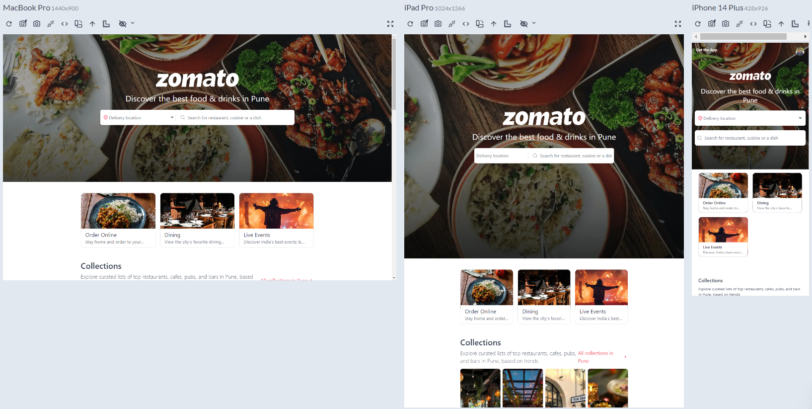
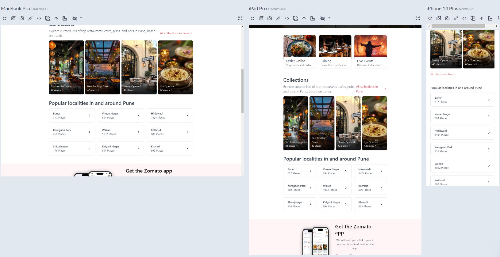

# 🍽️ Zomato - Responsive Homepage

A sleek, responsive Zomato-inspired homepage built with **React, Tailwind CSS, and TypeScript**. This weekend project showcases my frontend skills, focusing on **modern UI/UX, responsiveness, and smooth user interactions**.

## 🚀 Features

✅ **Fully Responsive UI** – Works seamlessly on mobile, tablet, and desktop  
✅ **Dynamic Search Bar** – Interactive location and restaurant search input  
✅ **Tailwind CSS Styling** – Clean and maintainable styling for fast development  

## 🎥 Demo

Check out the live demo here: <a href="https://amitpatil321.github.io/zomato-responsive-design/" target="_blank">🚀 Live Preview</a>

## 📸 Screenshots

 


## 🛠️ Tech Stack

- **Frontend:** React, TypeScript, Tailwind CSS  
- **Icons & UI:** React Icons
- **Development Tools:** Vite, ESLint, Prettier  

## 🏗️ Setup & Installation

1. **Clone the repository**
   ```sh
   git clone https://github.com/your-username/zomato-clone.git
   cd zomato-responsive-design

2. **Install dependencies**
   ```sh
   npm install

3. **Run the development server**
   ```sh
   npm run dev

4. **Open the app**
   ```sh
   http://localhost:5173

## 📜 License
This project is MIT licensed. Feel free to use, modify, and distribute it as needed.

   
